<u>**Table of Contents**</u>
<!-- TOC -->

- [Overview](#overview)
- [Architecture](#architecture)
- [Project Steps](#project-steps)
    - [Authentication](#authentication)
        - [Service Principal](#service-principal)
        - [Workspace Share](#workspace-share)
    - [AutoML Experiment](#automl-experiment)
        - [Registered Datasets](#registered-datasets)
        - [Completed Experiment](#completed-experiment)
        - [Best Model](#best-model)
    - [Deploy the Best Model](#deploy-the-best-model)
    - [Enable Logging](#enable-logging)
        - [Application Insights Enabled](#application-insights-enabled)
        - [Logging Enabled](#logging-enabled)
    - [Swagger Documentation](#swagger-documentation)
        - [Swagger UI](#swagger-ui)
    - [Consume Model Endpoints](#consume-model-endpoints)
        - [Endpoint Result](#endpoint-result)
        - [Apache Benchmark](#apache-benchmark)
    - [Create and Publish a Pipeline](#create-and-publish-a-pipeline)
        - [Create Pipeline](#create-pipeline)
        - [Bankmarketing dataset with AutoML Module](#bankmarketing-dataset-with-automl-module)
        - [Published Pipeline overview](#published-pipeline-overview)
        - [Use RunDetailsWidget](#use-rundetailswidget)
        - [Pipeline Endpoint](#pipeline-endpoint)
        - [Scheduled run in ML Studio](#scheduled-run-in-ml-studio)
- [Future Improvements](#future-improvements)
- [Screen Recording](#screen-recording)

<!-- /TOC -->

# Overview
In this project, we perform a classification task on the Bank Marketing dataset using AzureML's AutoML and Pipeline. contains the information of a bank's prospective customers to whom direct marketing calls have been made. It contains such information as: age, marital status, job, duration of call etc. and we seek to predict if the customer will subscribe to a term deposit. In the dataset, this target is coded as the y variable with values: yes and no. Further details about this data is available [here](https://archive.ics.uci.edu/ml/datasets/Bank+Marketing).

# Architecture

As mentioned above, this project uses a Bank Marketing dataset available [here](https://automlsamplenotebookdata.blob.core.windows.net/automl-sample-notebook-data/bankmarketing_train.csv). AzureML allows the creation of **Tabular Datasets** from URL Paths and we take advantage of that convenience method here. The created Tabular Dataset is converted into a **pandas DataFrame** before it is passed into the AutoML Config. 

Azure AutoML trains and tunes a model on provided data using a specified metric passed into the **primary_metric** parameter. Here, AUC Weighted is used. This is informed by the class imbalance of the dataset since simpler metrics like Accuracy may provide misleasing information about the performance of models. [Classification Problem in Imbalanced Datasets](https://www.intechopen.com/books/recent-trends-in-computational-intelligence/classification-problem-in-imbalanced-datasets), Mahani et al (2019), provides useful reading about this subject. 

Since little is done in the way of preprocessing and featurization, the **featurization** parameter of the AutoML is cofigured to 'auto'. The maximum number of concurrent runs (max_concurrent_iterations), experiment timeout (experiment_timeout_minutes) and early stopping (enable_early_stopping) are some other interesting parameters that are defined as part of the AutoML configuration. 

The AutoML configuration is passed as a step of pipeline that is submitted as an experiment. Its output: **metrics** of the child runs and the tuned **model**, are collected using **PipelineData** objects to allow easy retrieval. They can be used an input to further pipeline steps. The tuned model is retrieved and saved locally while the pipeline is published. Publishing a pipeline allows it to be rerun from any platform using HTTP requests. 

# Project Steps
## Authentication
In this step, a Service Principal is created and granted access to resources in the current workspace. 
### Service Principal
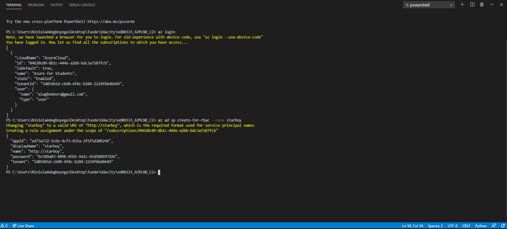
### Workspace Share

## AutoML Experiment
With authentication completed, in this step, we create and register a dataset with the workspace. Registering a dataset ensures that it persists and is accessible to all users across a workspace. It also allows versioning. A compute cluster is also created as target for the AutoML classification experiment. 
### Registered Datasets
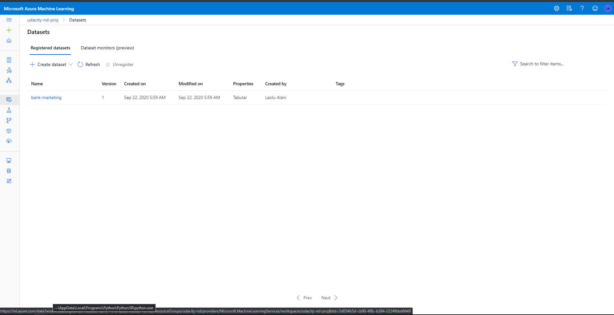
### Completed Experiment
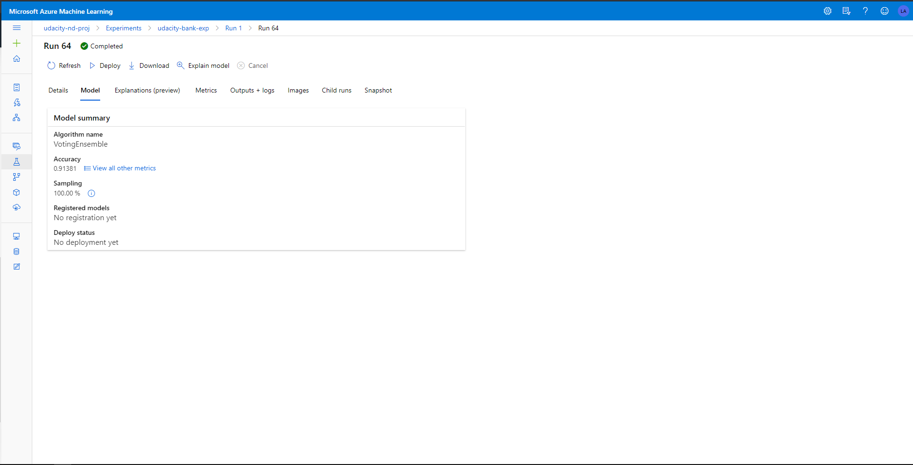
### Best Model
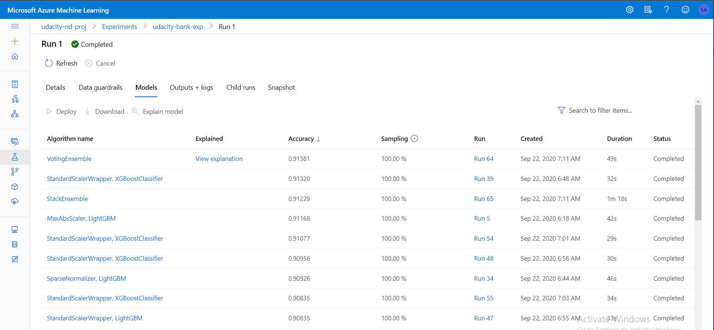

## Deploy the Best Model
Azure AutoML tries and reports performance of a handful of models before outputting the best performing model. The outputted model is deployed in this step enabling it to respond to POST requests sent over HTTP. 

## Enable Logging
The health of the deployed model is critical and logs allow us to monitor health.In this step, we enable Application Insights by retrieving the deployed Webservice object and updating its configurations. Subsequently, the logs can then be viewed by running [logs.py](starter_files\logs.py). 
### Application Insights Enabled
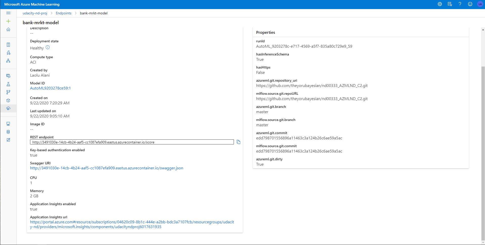
### Logging Enabled
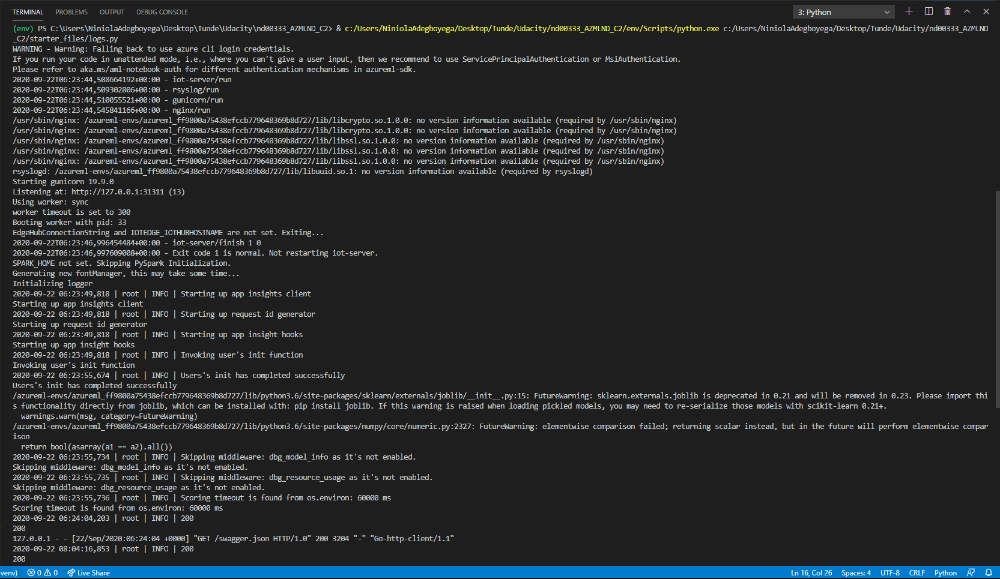

## Swagger Documentation
Testing the deployed model allows us to monitor both performance and behavior. The Swager UI allows us to achieve this. Azure provides a JSON files with description of the expected behavior of the deployed model. When run in a docker container, the Swagger UI allows examination of thie JSON file as well as interaction with the model endpoint. 
### Swagger UI
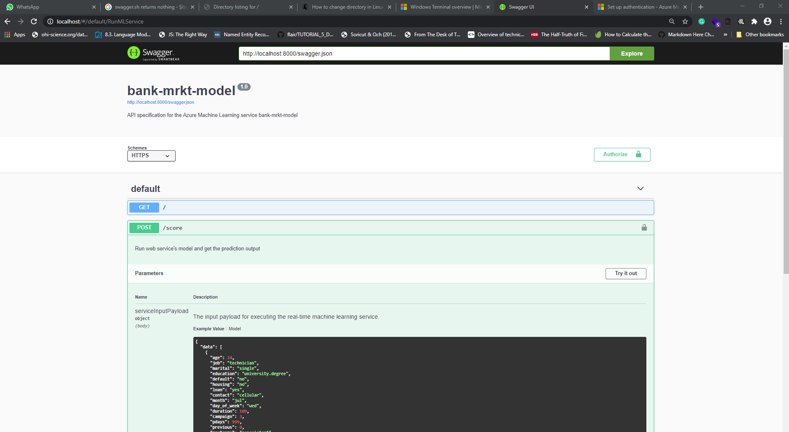
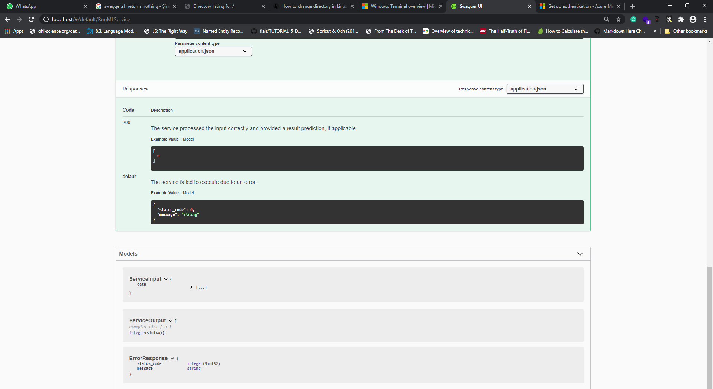

## Consume Model Endpoints
The model can also be interacted with python scripts and this step achieves that. Azure provides a scoring uri to allow access to the model as well as a key to ensure security. These are necessary in order to interact with the model using Python scripts locally. Further, the robustness of the deployed model's performance is investigated using the Apache Benchmark. 
### Endpoint Result
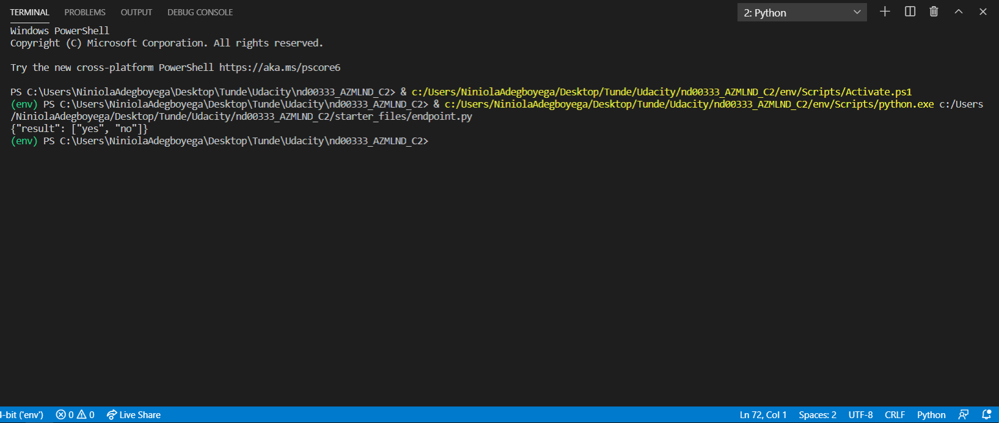
### Apache Benchmark
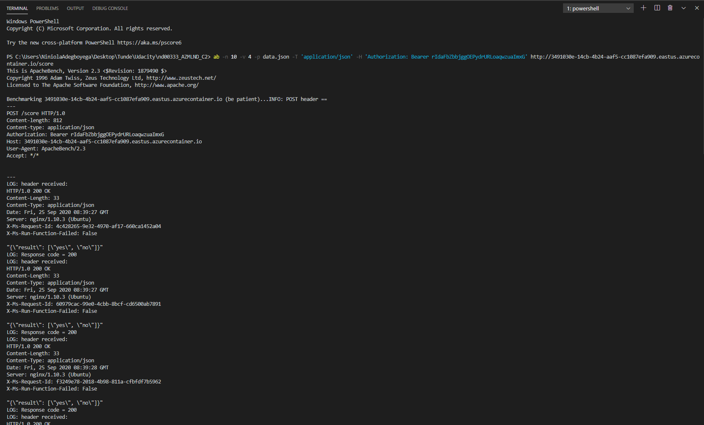

## Create and Publish a Pipeline
The created pipeline is published in this section to ensure that it can be rerun using HTTTP Requests. This feature becomes important and incredibly convenient as newer versions of the BankMarketing dataset are registered in the workspace. 
### Create Pipeline
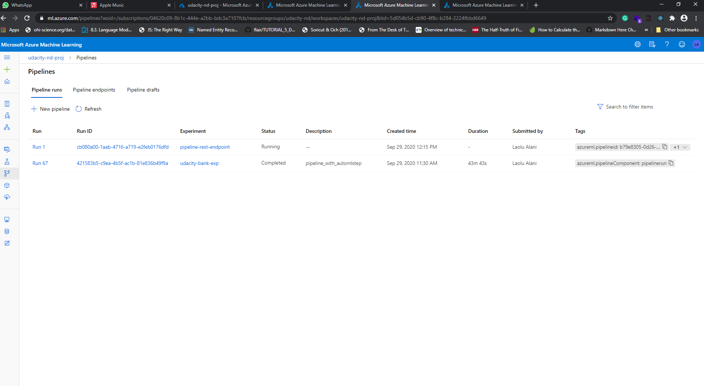
### Bankmarketing dataset with AutoML Module

### Published Pipeline overview
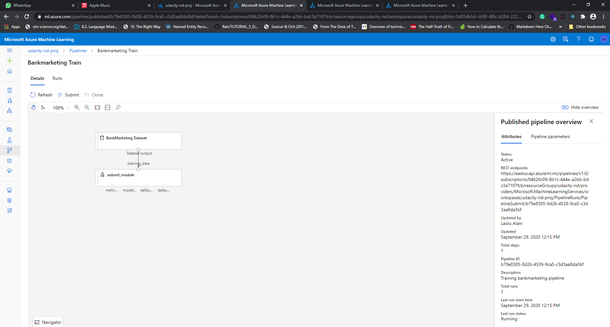
### Use RunDetailsWidget
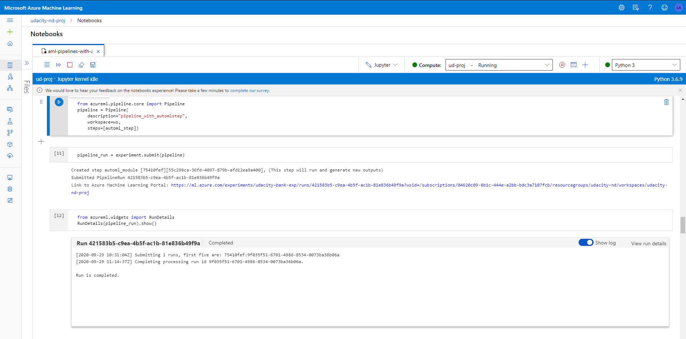
### Pipeline Endpoint
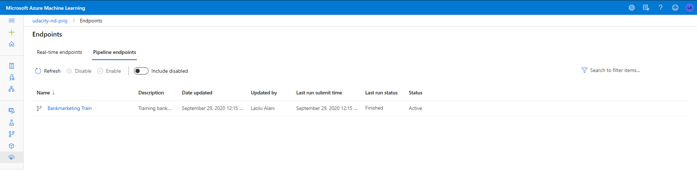
###  Scheduled run in ML Studio
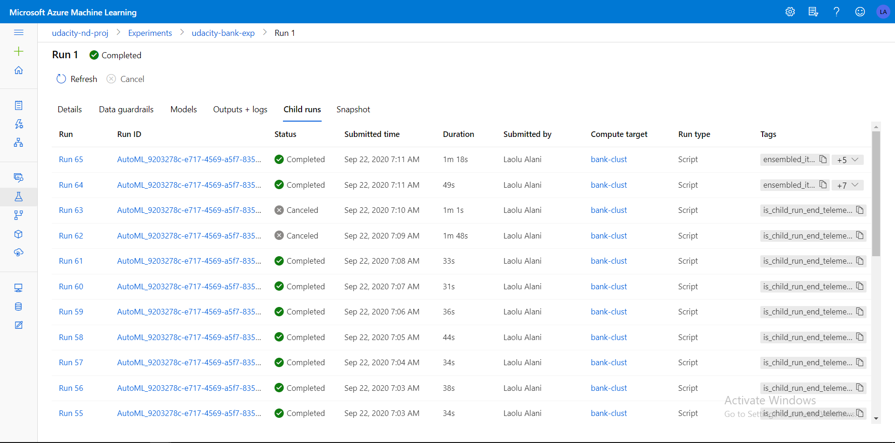

# Future Improvements
While AzureML's AutoML is incredibly powerful, in future experiments it will be interesting to implement a pipeline with multiple steps. Data cleaning, preprocessing and model building can reside in individual steps. Machine Learning involves a lot of experimentation and decoupling the steps this way will ease experimentation and iteration towards the best performing model. An example of where experimentation may pay off is in feature interactions. For many classfication tasks, feature interactions can help improve the performance of model. A multi-step pipeline ensures that experimentation with feature interactions can be done without making undue changes, deliberately or indeliberately, to other aspects of the pipeline. 
Also, multi-step pipelines ease the maintenance of the machine learning model in production. 

# Screen Recording
[Operationalizing Machine Learning in Azure](https://youtu.be/Pkf9iJQxBGk)
